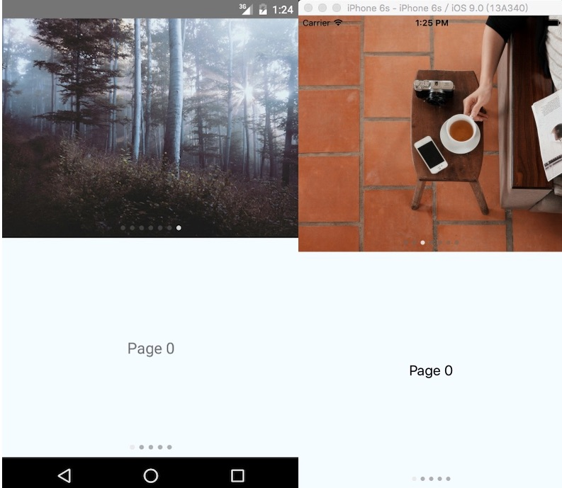

# react-native-viewpager

[](https://www.npmjs.com/package/react-native-viewpager)
[](https://www.npmjs.com/package/react-native-viewpager)


This is the `ViewPager` componnent in React Native both for Android and iOS.
This is a JavaScript-only implementation of pager for React Native. Like `ListView`,
this can render hundreds of pages without performance issue. Better than the one in
Android, this `ViewPager` can **auto play** -- turn page automaticly, **loop** -- make infinite scrolling.

## Demo



Demo project is [here](./Sample).

## Usage

1. Run `npm install react-native-viewpager --save`
2. Code like this:

```
var ViewPager = require('react-native-viewpager');
<ViewPager
    dataSource={this.state.dataSource}
    renderPage={this._renderPage}/>
```

## More configuration

* **`dataSource`**: this is require to provide pages data,
* **`renderPage`**: this is require to render page view,
* **`autoPlay`**: `true` to turn page automaticly,
* **`isLoop`**: `true` to run in infinite scroll mode,
* **`locked`**: `true` to disable touch scroll,
* **`onChangePage`**: page change callback,
* **`renderPageIndicator`**: render custom ViewPager indicator.

## Animated Transition Controls

* **`transitionFriction`**: number or function that returns a number to set custom friction value for animated page transitions.
* **`transitionTension`**: number or function that returns a number to set custom tension value for animated page transitions.

Example:
```
var ViewPager = require('react-native-viewpager');
<ViewPager
    dataSource={this.state.dataSource}
    renderPage={this._renderPage}
    transitionFriction={(vx) => {
      // function receives the gestureState vx property
      return vx*100;
    }}
    transitionTension={10}
/>
```

## Licensed

MIT License
